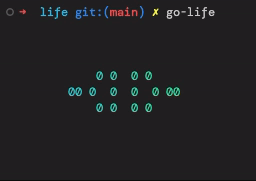

# Conway's Game of Life



A simple terminal application that allows users to create their own organisms and
simulate its states. Based on the [famous cellular automaton](https://en.wikipedia.org/wiki/Conway%27s_Game_of_Life).

To run this application locally from the command line execute the following commands
```
go install github.com/ethanefung/go-life@latest
go-life
```

# Minimum Viable Product -  How to
This repository is under active development. However, the application is functional.
Once the application is started with the `go-life` executable above, a grid of zeros
will be drawn in your terminal. There is an `X` in the middle of the grid that
represents your cursor. Use the arrow keys or `h,j,k,l` to move the cursor across the
grid. Press space to toggle a cell from 0 -> 1 or 1 -> 0. 1 represents a live cell and
0 a dead cell. Once you're happy with your organism, press enter to play the simulation.
Pressing enter again to pause the simulation which can be helpful if you want to setup
another organism before it dies.

1. `enter` - toggles the simulation from play -> pause and vise versa
2. `space` - toggles the cell of the cursor from dead -> alive and vise versa
3. arrow keys moves the cursor. Alternatively, you can use the `h, j, k, l` keys

